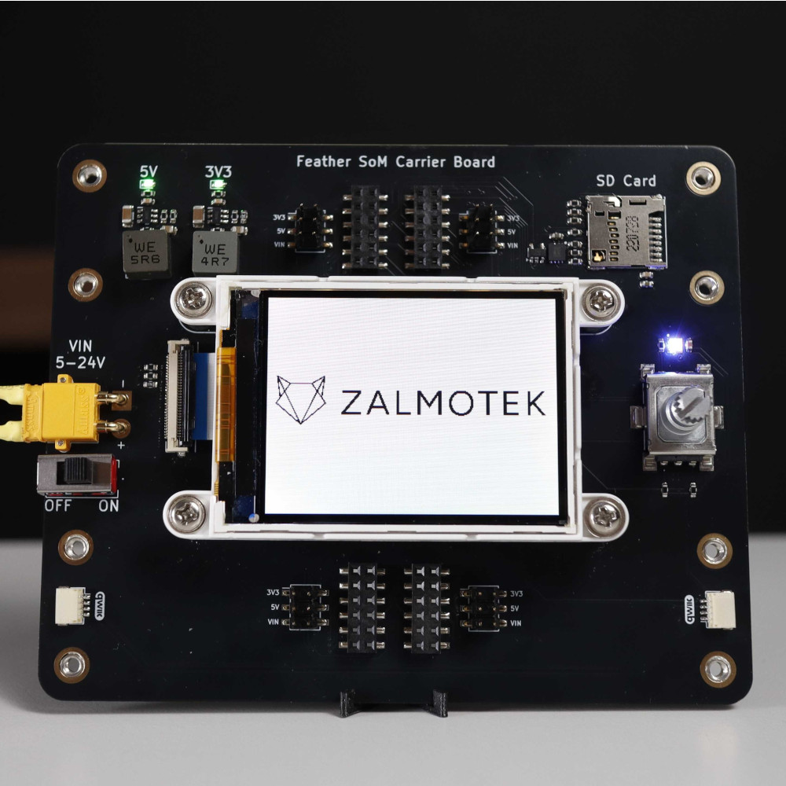
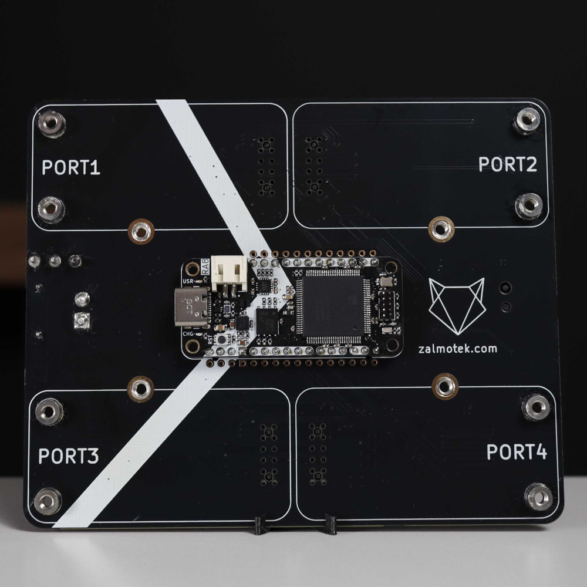
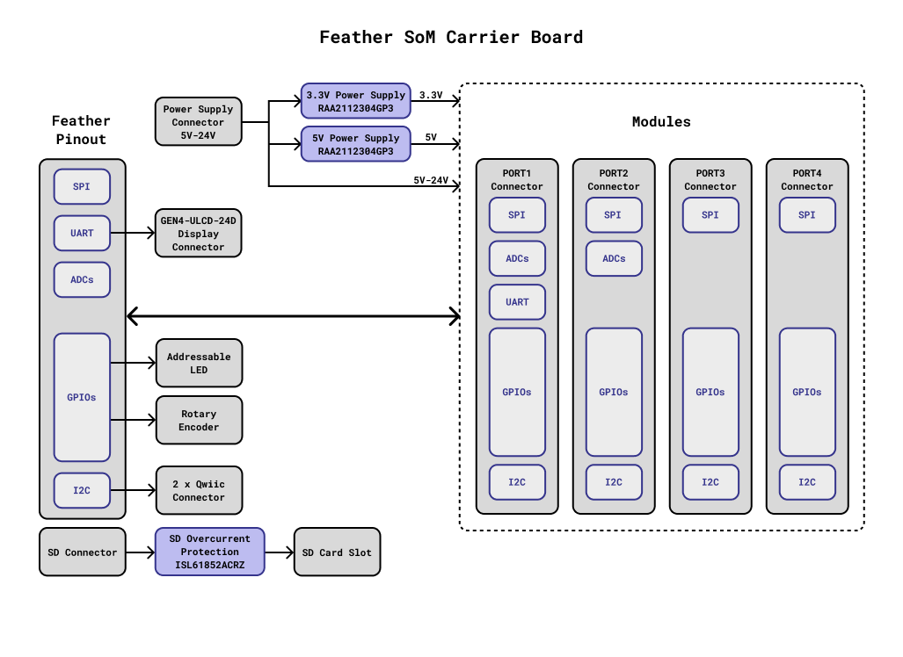

# Zalmotek Feather SoM Carrier Board

 

## Overview

This repository contains the **KiCad project files and documentation** for a versatile Carrier Board designed to expand the functionality of several compatible Feather System-on-Modules (SoMs). The board provides a flexible platform for rapid prototyping and integration of advanced modules, with comprehensive support for a variety of Zalmotek Feather SoMs.

## Supported Feather SoMs

The Carrier Board is compatible with the following Feather SoMs:

- **RA0E1 Feather SoM**
- **RA2E1 Feather SoM**
- **RA4M1 Feather SoM**
- **RA6M1 Feather SoM**
- **RA8M1 Feather SoM**
- **RZ/A3UL Feather SoM**
- **RZ/A3M Feather SoM**

## Expansion Module Support

The board features four modular ports, enabling connectivity with a range of expansion modules, including:

- **Dynamixel Motor Driver Module**
- **Particle M-SoM Breakout Module**
- **Ethernet Module**
- **CAN Module**

## Connector Pinout

Each of the four module ports provides a consistent pinout, with power rails selectable via jumpers for maximum flexibility. The pinout for each port is as follows:

| Pin | Function | Notes |
| :-- | :-- | :-- |
| 1 | GND |  |
| 2 | VCC (3V3, 5V, or VIN 5–24V) | Selectable via jumper (J5/J6/J11/J12) |
| 3 | SCK |  |
| 4 | 3V3 (from Feather SoM) |  |
| 5 | MOSI |  |
| 6 | SDA |  |
| 7 | MISO |  |
| 8 | SCL |  |
| 9 | See per-port assignment below |  |
| 10 | See per-port assignment below |  |
| 11 | See per-port assignment below |  |
| 12 | See per-port assignment below |  |

**Port-specific GPIO mapping:**

| Port | Pin 9 | Pin 10 | Pin 11 | Pin 12 | VCC Jumper |
| :-- | :-- | :-- | :-- | :-- | :-- |
| PORT1 | RX | A4/D24 | TX | A5/D25 | J5 |
| PORT2 | A0 | A2/D22 | A1 | A3/D23 | J6 |
| PORT3 | D9 | D12 | D6 | D14 | J11 |
| PORT4 | D10 | D13 | D5 | D11 | J12 |

## Additional Onboard Features

- **Rotary Encoder with Push-Button**
- **Neopixel RGB LED**
- **SD Card Connector:** Compatible with native SDHI pins on RZ/A3UL, RZ/A3M, and RA8M1 Feather SoMs.
- **2 x Qwiic Connectors:** For easy I²C expansion.
- **Display Connector:** Supports 4D Systems gen4-uLCD-24D display.

## Jumper Configuration

Certain onboard features and port assignments share GPIOs. Their function can be selected via jumpers as described below:

| Jumper | Default (1–2) | Alternate (2–3) |
| :-- | :-- | :-- |
| JP1 | TX to display connector | TX to PORT1 |
| JP2 | D5 to Neopixel | D5 to PORT4 |
| JP3 | RX to display connector | RX to PORT1 |
| JP4 | D11 to encoder | D11 to PORT4 |
| JP5 | D12 to encoder | D12 to PORT3 |
| JP6 | D13 to encoder | D13 to PORT10 |
| JP7 | D14 to display connector | D14 to PORT3 |

*Refer to the schematic for detailed signal routing and jumper positions.*

## Power Input

- **Input Voltage:** 5–24V DC
- **Connector:** AMASS XT30PW-M

## Mechanical Specifications

- **M3 mounting holes**
- **Carrier Board Dimensions: 100 x 130 mm**

**For detailed schematics, board layout, and further documentation, please refer to the project files included in this repository.**

*Last updated: June 30, 2025*
